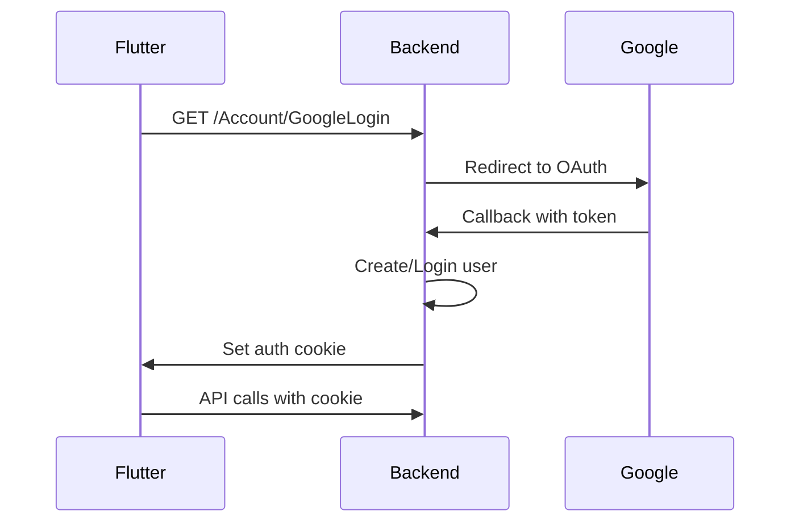

# 📚 API Documentation Index - Hotel Web

Chào mừng bạn đến với tài liệu API của dự án Hotel Web! Đây là hệ thống backend phục vụ cho ứng dụng Flutter về sức khỏe và dinh dưỡng.

---

## 🎯 Mục Đích Dự Án

Hotel Web là nền tảng kết hợp:
- 🍲 **Food Order System**: Đặt món ăn online
- 🏥 **Health Profile**: Quản lý hồ sơ sức khỏe
- 📱 **Social Feed**: Chia sẻ bài viết về sức khỏe
- 💊 **Bài Thuốc**: Tra cứu và tạo bài thuốc dân gian
- 🤖 **AI Food Analysis**: Phân tích dinh dưỡng từ ảnh món ăn

---

## 📖 Tài Liệu Có Sẵn

### 1. [API_DOCUMENTATION.md](./API_DOCUMENTATION.md) 📘
**Dành cho: Flutter Developers**

Tài liệu chi tiết về tất cả API endpoints:
- ✅ Chi tiết từng endpoint
- ✅ Request/Response examples
- ✅ Authentication flow
- ✅ Error handling
- ✅ Models & DTOs
- ✅ Best practices cho Flutter

**Khi nào dùng**: Khi cần hiểu đầy đủ về một API endpoint

---

### 2. [API_QUICK_REFERENCE.md](./API_QUICK_REFERENCE.md) 📝
**Dành cho: Quick Lookup**

Tham khảo nhanh các endpoints:
- ✅ Bảng tổng hợp endpoints
- ✅ HTTP methods & status codes
- ✅ Flutter code examples
- ✅ Common errors & solutions
- ✅ Tips & tricks

**Khi nào dùng**: Khi cần tra cứu nhanh endpoint hoặc code snippet

---

### 3. [API_DEVELOPMENT_GUIDE.md](./API_DEVELOPMENT_GUIDE.md) 🚀
**Dành cho: Backend Developers**

Hướng dẫn phát triển API mới:
- ✅ Kiến trúc dự án
- ✅ Template code cho Controller/Service/Repository
- ✅ Database migrations
- ✅ Best practices
- ✅ Testing strategies
- ✅ Troubleshooting

**Khi nào dùng**: Khi cần tạo thêm API endpoints mới

---

## 🚀 Quick Start

### Cho Flutter Developer

1. **Đọc tổng quan**: [API_DOCUMENTATION.md](./API_DOCUMENTATION.md#thông-tin-chung)
2. **Setup authentication**: [Authentication Flow](./API_DOCUMENTATION.md#1-authentication--user-management)
3. **Test với Postman**: Import collection từ section Testing
4. **Implement trong Flutter**: Sử dụng examples trong [Quick Reference](./API_QUICK_REFERENCE.md#-flutter-http-examples)

### Cho Backend Developer

1. **Hiểu kiến trúc**: [Project Structure](./API_DEVELOPMENT_GUIDE.md#1-kiến-trúc-dự-án)
2. **Tạo API mới**: Follow [template](./API_DEVELOPMENT_GUIDE.md#2-cách-tạo-api-controller-mới)
3. **Test API**: Sử dụng [testing guide](./API_DEVELOPMENT_GUIDE.md#7-testing)
4. **Update docs**: Thêm vào API_DOCUMENTATION.md

---

## 🔥 Current APIs

| Module | Base Route | Status | Docs |
|--------|-----------|--------|------|
| Authentication | `/Account` | ✅ Live | [Link](./API_DOCUMENTATION.md#1-authentication--user-management) |
| Social Feed | `/api/PostAPI` | ✅ Live | [Link](./API_DOCUMENTATION.md#2-social-feed-api-postapi) |
| Order & Cart | `/api/OrderFoodAPI` | ✅ Live | [Link](./API_DOCUMENTATION.md#3-food-order-api-orderfoodapi) |
| Bài Thuốc | `/api/BaiThuocAPI` | ✅ Live | [Link](./API_DOCUMENTATION.md#4-bài-thuốc-api-baithuocapi) |
| Food Analysis | `/api/FoodAnalysis` | ✅ Live | [Link](./API_DOCUMENTATION.md#5-food-analysis-api-foodanalysis) |
| Health Profile | `/api/HealthProfile` | ✅ Live | [Link](./API_DOCUMENTATION.md#6-health-profile-api-healthprofile) |
| Món Ăn | `/MonAn` | ✅ Live | [Link](./API_QUICK_REFERENCE.md#-món-ăn-monan) |

---

## 🛠️ Tech Stack

### Backend
- **Framework**: ASP.NET Core 6/7
- **ORM**: Entity Framework Core
- **Database**: SQL Server
- **Authentication**: ASP.NET Identity + Google OAuth
- **Real-time**: SignalR (ChatHub)
- **Payment**: VNPay Integration

### Services
- **AI Integration**: Python API for food analysis
- **External APIs**: 
  - Google OAuth
  - Gemini API (nutrition advice)
  - VNPay Payment Gateway

---

## 📊 Database Schema

### Core Tables
- `AspNetUsers` - User accounts (Identity)
- `BaiDang` - Social posts
- `BaiThuoc` - Traditional medicine recipes
- `MonAn` - Food dishes
- `GioHang` + `GioHangChiTiet` - Shopping cart
- `HealthProfile` - User health records
- `Order` + `OrderDetail` - Order history
- `Friendships` - Friend relationships
- `ArticleViews` - View tracking

### Relationships
```
User (1) ─── (N) BaiDang
User (1) ─── (N) BaiThuoc
User (1) ─── (1) HealthProfile
User (1) ─── (1) GioHang ─── (N) GioHangChiTiet ─── (1) MonAn
User (A) ─── (B) User (via Friendships)
```

---

## 🔑 Authentication Flow



---

## 📱 API Response Format

### Success Response
```json
{
  "success": true,
  "data": { ... },
  "message": "Optional message"
}
```

### Error Response
```json
{
  "success": false,
  "error": "Error message",
  "details": "Detailed info (dev only)"
}
```

---

## 🧪 Testing

### Postman Collection
Có sẵn trong [API_DOCUMENTATION.md](./API_DOCUMENTATION.md#13-testing-với-postman)

### Test Accounts
```
Regular User:
- Email: test@example.com
- Password: Test@123

Admin:
- Email: admin@example.com
- Password: Admin@123
```

---

## 🐛 Common Issues & Solutions

### Issue: CORS Error
**Solution**: Backend đã config CORS cho Flutter. Đảm bảo request từ đúng origin.

### Issue: 401 Unauthorized
**Solution**: 
1. Đăng nhập để lấy cookie
2. Gửi cookie trong mọi request
3. Kiểm tra cookie expiration

### Issue: Image Upload Failed
**Solution**: 
1. Kiểm tra file size (< 5MB)
2. Validate file type (jpg, png, gif)
3. Đảm bảo folder `wwwroot/uploads` tồn tại

Chi tiết: [Troubleshooting Guide](./API_DEVELOPMENT_GUIDE.md#8-troubleshooting)

---

## 📞 Support & Contact

### Developers
- **Backend Lead**: [Your Name]
- **Flutter Lead**: [Flutter Dev Name]

### Resources
- **Project Repo**: [GitHub Link]
- **API Base URL**: `https://your-domain.com/api`
- **Swagger UI**: `https://your-domain.com/swagger` (if enabled)

### Communication
- **Slack**: #hotel-web-api
- **Email**: dev@yourdomain.com

---

## 🗓️ Roadmap

### ✅ Completed (v1.0)
- [x] User authentication (Google OAuth)
- [x] Social feed with mixing algorithm
- [x] Food ordering & cart
- [x] Health profile management
- [x] Food analysis with AI
- [x] Bài thuốc CRUD

### 🚧 In Progress (v1.1)
- [ ] Like/Comment/Share features
- [ ] Friend management (send/accept requests)
- [ ] Order checkout flow
- [ ] Payment integration (VNPay)
- [ ] Real-time notifications (SignalR)

### 🔮 Planned (v2.0)
- [ ] Doctor consultation booking
- [ ] Health plan recommendations
- [ ] Meal planning AI
- [ ] Nutrition tracking
- [ ] Exercise logging
- [ ] Health progress charts

---

## 📝 Change Log

### [1.0.0] - 2025-11-08
**Added**
- Complete API documentation for Flutter
- Development guide for backend developers
- Quick reference guide
- README index

**Features**
- Authentication with Google OAuth
- Social feed with content mixing
- Food order & cart management
- Health profile CRUD
- AI food analysis
- Bài thuốc management

---

## 📜 License

[Your License Here]

---

## 🙏 Acknowledgments

- ASP.NET Core Team
- Flutter Community
- Google AI (Gemini)
- VNPay

---

**Happy Coding! 🎉**

---

## Navigation

| Document | Description | Target Audience |
|----------|-------------|-----------------|
| [API_DOCUMENTATION.md](./API_DOCUMENTATION.md) | Chi tiết tất cả endpoints | Flutter Developers |
| [API_QUICK_REFERENCE.md](./API_QUICK_REFERENCE.md) | Tham khảo nhanh | All Developers |
| [API_DEVELOPMENT_GUIDE.md](./API_DEVELOPMENT_GUIDE.md) | Hướng dẫn phát triển | Backend Developers |
| [DESIGN_CHANGES.md](./DESIGN_CHANGES.md) | Design decisions | All Team Members |

---

**Last Updated**: November 8, 2025
